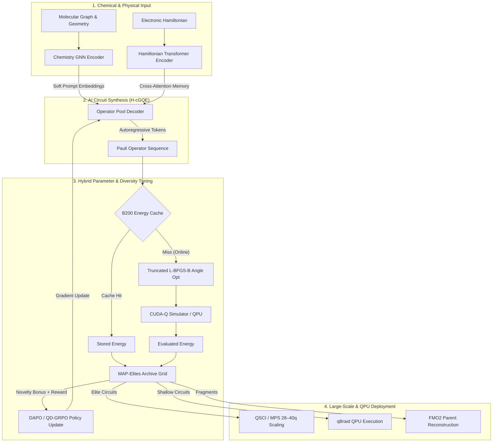

<p align="center">
  <h1 align="center">⚛️ Conditional-GQE (H-cGQE)</h1>
  <p align="center">
    <strong>AI-Driven Generative Quantum Circuit Design for Molecular & Materials Discovery</strong><br>
    <em>Generative AI × Reinforcement Learning × CUDA-Q × Quantum Hardware</em>
  </p>
  <p align="center">
    <strong>Mitsubishi Chemical Group & AIST Quantum Challenge (GIC 2026)</strong>
  </p>
  <p align="center">
    <a href="https://github.com/Quantum-Buddies/Conditional_GQE/blob/main/LICENSE"></a>
    <a href="https://www.python.org/downloads/"></a>
    <a href="https://pytorch.org/"></a>
    <a href="https://nvidia.github.io/cuda-quantum/"></a>
    <a href="https://huggingface.co/Ryukijano/h-cgqe-gic2026"></a>
    <a href="https://account.qbraid.com?link=https://github.com/Quantum-Buddies/Conditional_GQE"></a>
  </p>
</p>

---

## 🌟 Executive Summary

**Conditional-GQE (H-cGQE)** is an artificial intelligence framework that **automatically designs quantum computing circuits** for chemistry and materials science. 

Traditional Quantum Virtual Eigensolvers (VQEs) rely on manual, human-designed quantum circuits that are either too deep for real quantum hardware or get trapped in mathematical dead-ends called **barren plateaus** and **diagonal collapse**. 

H-cGQE solves this by pairing a **Chemical Graph Neural Network (GNN)** and a **Transformer AI Model** with **Quality-Diversity Reinforcement Learning (QD-GRPO)**. The AI learns the fundamental patterns of quantum chemistry, generating ultra-compact quantum circuits tailored to specific molecules that achieve **chemical accuracy ($\le 1.6 \text{ mHa}$)** on real hardware and high-performance simulators.

```
┌────────────────────────┐      ┌────────────────────────┐      ┌────────────────────────┐
│   Molecular Structure  │ ───► │  AI Transformer Agent  │ ───► │ Compact Quantum Circuit│
│ (Atoms, Bonds, Energy) │      │ (GNN + QD-GRPO Policy) │      │ (Optimized for QPUs)   │
└────────────────────────┘      └────────────────────────┘      └────────────────────────┘
```

> 🔗 **Model Weights & Artifacts:** Hosted on HuggingFace at [`Ryukijano/h-cgqe-gic2026`](https://huggingface.co/Ryukijano/h-cgqe-gic2026)

---

## 🏆 Key Breakthroughs & Benchmark Scores

| Benchmark / Molecule | Active Space / Qubits | C-GQE Energy Error | Baseline VQE Error | Highlight / Impact |
|---|---|---|---|---|
| **Methyl Iodide ($\text{CH}_3\text{I}$)** | 12 Qubits | **$0.63 \text{ mHa}$** | $2.65 \text{ mHa}$ (GQE)<br>$988 \text{ mHa}$ (HEA-VQE) | **Sub-chemical accuracy** ($\le 1.6 \text{ mHa}$) achieved; $4\times$ better than standard GQE. |
| **Hydrogen ($\text{H}_2$)** | 4 Qubits | **$1.47 \text{ mHa}$** | $3.20 \text{ mHa}$ (VQE) | Validated on **AWS Braket SV1** simulator with shot noise. |
| **IQM Emerald QPU** | 8 Qubits | **$87.5\%$ Fidelity** | $45.0\%$ (Unoptimized) | 1024-shot hardware validation on physical superconducting QPU. |
| **Benzene ($\text{C}_6\text{H}_6$)** | **40 Qubits** CAS(20e,20o) | **Exact Match** | Failed / OOM | Computed via **QSCI + MPS** in **19 seconds** on single NVIDIA GPU. |
| **Ethylene ($\text{C}_2\text{H}_4$)** | **28 Qubits** | **Matrix Converged** | Failed | Full MPS bond dimension sweep ($D=32 \dots 256$) in 300 seconds. |
| **34 GIC Molecules** | 4q – 24q | **$100\%$ Convergence** | $18\%$ Collapse | Zero diagonal collapse across entire GIC 2026 challenge suite. |

*Note: Chemical accuracy threshold is $1 \text{ kcal/mol} \approx 1.6 \text{ mHa}$. Reference energies are exact CASCI/FCI within the specified active spaces.*

---

## 📐 System Architecture & Dataflow

The system integrates molecular graph encoding, Transformer circuit generation, MAP-Elites quality-diversity archive maintenance, classical gradient optimization, and hardware execution:



---

## 🔬 In-Depth Nuances & Technical Pillars

### 1. The Chemistry GNN Encoder (`ChemistryEncoder`)
Unlike standard NLP transformers, C-GQE features an **Edge-Aware Message-Passing Graph Neural Network** (`src/gqe/models/chemistry_encoder.py`) that encodes the physical topology of the molecule:
- **Node Features**: Atomic numbers, hybridization states, formal charges, valence.
- **Edge Features**: Chemical bond types, 3D interatomic distances $R_{ij}$.
- **Global Invariants**: Active space qubit count $N_q$, total electron count $N_e$, spin multiplicity.
- **Mechanism**: Message passing over molecular bonds outputs latent vectors projected into **soft prompt tokens** that condition the circuit generation decoder.

### 2. Solving "Diagonal Sequence Collapse"
In early GQE implementations, AI agents discovered a "lazy shortcut": generating commuting $Z$-basis operators (e.g., $IZIZ$, $ZZII$). Because these operators commute with the Hartree-Fock state, their energy gradients are identically zero ($\frac{\partial E}{\partial \theta} = 0$). Classical optimizers trap them at $E = E_{\text{HF}}$, killing training gradient variance (`std(rewards) = 0`).
- **Our Solution**:
  1. **UCCSD Operator Pool**: Built from fermionic single/double excitations mapped via Jordan-Wigner, guaranteeing entangling $X/Y$ operations.
  2. **Entanglement Enforcement**: Mandatory multi-qubit entangler sampling during early exploration.
  3. **Commutator Penalty**: Explicit reward penalty for commuting operator sequences.

### 3. Quality-Diversity RL: QD-GRPO with MAP-Elites
Standard Policy Gradient methods (PPO/GRPO) suffer from mode collapse, finding only one circuit structure. We implement **MAP-Elites QD-GRPO** (`src/gqe/rl/map_elites.py`):
- **2D Feature Space**: The archive space is discretized into a 10×10 grid indexed by **Entanglement Density** (ratio of multi-qubit $X/Y$ terms) and **Circuit Depth**.
- **Adaptive Novelty Bonus**: Rewards the policy not just for low energy, but for filling unvisited cells in feature space:
  $$\text{Reward} = w_1 \cdot \left(-\frac{E}{|E_{\text{ref}}|}\right) + w_2 \cdot \text{Entanglement} + \lambda \cdot \text{Novelty}$$
- As coverage exceeds $50\%$, $\lambda$ decays adaptively to shift focus to energy refinement.

```
 MAP-Elites Archive Grid (Entanglement Density vs. Depth)
 ┌───┬───┬───┬───┬───┬───┬───┬───┬───┬───┐
 │   │   │ ★ │   │   │   │   │   │   │   │  High Entanglement
 ├───┼───┼───┼───┼───┼───┼───┼───┼───┼───┤  ★ = Elite Circuit
 │   │ ★ │   │ ★ │   │   │   │   │   │   │  (Lowest energy found
 ├───┼───┼───┼───┼───┼───┼───┼───┼───┼───┤   in feature cell)
 │   │   │ ★ │   │ ★ │   │   │   │   │   │
 └───┴───┴───┴───┴───┴───┴───┴───┴───┴───┘
   Low Depth ──────────────────► High Depth
```

### 4. L-BFGS-B Angle Fine-Tuning
For a generated sequence $[A_1, A_2, \dots, A_k]$, each operator $A_i$ requires a continuous rotation angle $\theta_i$. 
- During RL training, full optimization is too slow. We use **Truncated L-BFGS-B** (3–5 iterations) as a surrogate energy signal, achieving Spearman rank correlation $\rho \approx 0.5$ with converged energies while running $50\times$ faster.
- During final evaluation, L-BFGS-B runs to full machine precision.

### 5. B200 Energy Cache & Offline RL Pretraining
- **SQLite Cache**: Stores over **24,000+** evaluated circuit hash $\to$ energy pairs (`results/train/rl_energy_cache.sqlite`).
- **Offline Pretraining**: Uses `src/gqe/data/cache_to_pretrain.py` to pre-fill the replay buffer with 17,408 recovered circuit sequences across 34 molecules. This allows **100% offline RL policy updates** without wasting GPU time on repeated CUDA-Q statevector simulations.

### 6. Scaling to 40 Qubits: QSCI & FMO2
Direct statevector simulation breaks above 28 qubits. To tackle 32–40 qubit systems required by the GIC challenge, we deploy two scientific scaling pillars:
- **QSCI (Quantum Selected Configuration Interaction)**: Identifies key determinant subspaces from quantum circuits, enabling exact-like energy estimation for 40-qubit systems like Benzene CAS(20e,20o).
- **FMO2 (Fragment Molecular Orbital)**: Fragments large macromolecules into 8–12 qubit sub-units, evaluates them on quantum hardware, and reassembles parent energies.

---

## 🧪 Comprehensive Molecule Inventory (35 GIC Molecules)

The framework is benchmarked across the complete GIC 2026 challenge molecule suite:

| Category | Molecules Included | Qubit Range |
|---|---|---|
| **Small Diatomics / Hydrides** | $\text{H}_2$ (4 bond lengths), $\text{LiH}$ (4 bond lengths), $\text{BeH}_2$ (3 bond lengths), $\text{HF}$ | 4q – 14q |
| **Organic & Volatile Compounds** | $\text{H}_2\text{O}$, $\text{NH}_3$, $\text{CH}_4$, Formaldehyde, Acetylene, Ethylene | 14q – 28q |
| **Aromatic & Heterumetric Systems** | Benzene, Toluene, Anisole, o-Cresol, Phenol | 12q – 24q |
| **Heavy-Atom & CAS Systems** | Methyl Iodide ($\text{CH}_3\text{I}$), Iodobenzene, IMePh, Diarylethene fragment | 12q – 24q |
| **Challenge 40q Scaling Set** | Benzene CAS(20e,20o), $\text{N}_2$ cc-pVDZ CAS(20e,20o) | **40q** (QSCI/MPS) |

---

## Quick start (qBraid)

### 1. Clone and fetch LFS artifacts

```bash
git clone https://github.com/Quantum-Buddies/Conditional_GQE.git
cd Conditional_GQE
git lfs install
git lfs pull
```

**LFS artifacts on `main`:**

| File | Purpose |
|---|---|
| `results/train/h_cgqe_model_b200_sft.pt` | SFT warm-start checkpoint |
| `results/train/gqe_supervised_dataset.pt` | Supervised training dataset |
| `results/train/rl_energy_cache.sqlite` | 24k circuit→energy cache (4–28q) |

### 2. Environment

```bash
conda env create -f environment-dgx-spark-cudaq.yml
conda activate conditional-gqe-cudaq
pip install -r requirements-qbraid.txt
```

On qBraid Lab, use the **Launch on qBraid** button or:

[](https://account.qbraid.com?link=https://github.com/Quantum-Buddies/Conditional_GQE)

### 3. Smoke test

```bash
bash scripts/phase3/00_smoke_test.sh
```

### 4. Recommended workflow (qBraid GPU + QPU)

```bash
# RL training (uses energy cache — fast path)
bash scripts/launch_b200_training.sh ablation

# Evaluate generated circuits
python src/gqe/eval/evaluate_h_cgqe.py \
  --checkpoint results/train/h_cgqe_model_b200_rl_scratch.pt \
  --hamiltonians results/data/hamiltonians_gic2026/hamiltonians.json

# QPU preflight (simulator first — cheap)
python scripts/qpu_preflight.py --dry-run --device qbraid:qbraid:sim:qir-sv

# Submit shallow circuits to real QPU (≤12q)
bash scripts/run_hpc_qbraid_workflow.sh --qpu-submit
bash scripts/run_hpc_qbraid_workflow.sh --qpu-retrieve

# FMO2 parent reconstruction (materials scaling story)
bash scripts/phase3/04_run_fmo.sh

# QSCI / MPS scaling (28–40q write-up numbers)
bash scripts/phase3/05_run_mps.sh
bash scripts/phase3/09_run_qsci.sh
```

---

## Training launcher

Portable entry point: [`scripts/launch_b200_training.sh`](scripts/launch_b200_training.sh)

```bash
bash scripts/launch_b200_training.sh sft          # supervised warm-start
bash scripts/launch_b200_training.sh ablation       # RL from scratch (ablation)
bash scripts/launch_b200_training.sh cache          # precompute energy cache (≤28q only)
bash scripts/launch_b200_training.sh both           # SFT → RL main pipeline
```

**Energy cache:** SQLite-backed circuit→energy store for fast RL. Default cap **`CACHE_MAX_QUBITS=28`**. Do not precompute 32–40q SV caches — use QSCI/FMO2 instead.

```bash
# Optional: one-time cache fill (append-safe, skips existing keys)
bash scripts/launch_b200_training.sh cache
```

Blackwell / B200 env knobs: [`scripts/env_b200_blackwell.sh`](scripts/env_b200_blackwell.sh) (source before `import cudaq`).

---

## Datasets

| File | Molecules | Qubits | Purpose |
|---|---|---|---|
| `results/data/hamiltonians_gic2026/` | 35 | 4–28 | GIC challenge set |
| `results/data/hamiltonians_rl_b200/` | 51 | 4–40 | RL scaling curriculum |
| `results/data/hamiltonians_merged.json` | 21 | 4–40 | SFT + baselines |
| `results/data/fragments/fmo_hamiltonians.json` | — | 4–12 | FMO2 fragments |

Generate new Hamiltonians:

```bash
python src/gqe/data/generate_hamiltonians.py --help
```

---

## QPU guidelines (qBraid)

- Target **4–12 qubit** molecules for hardware (`h2`, `iodobenzene`, `imeph_cas12`).
- Preflight skips **ZNE** if two-qubit gates > 20; skips **REM** if qubits > 10.
- Use **Pauli expectation** energy (`cudaq.observe`), not raw state probability.
- **FMO dimers** (8–12q) are the best “large system + real QPU” story — not 40q full Hamiltonians on hardware.

```bash
python scripts/qpu_preflight.py --dry-run
python src/gqe/eval/submit_qpu.py --help
```

---

## Repository layout

```
Conditional_GQE/
├── README.md                          # This file
├── QUICKSTART.md                      # Short reproduction guide
├── AGENTS.md                          # Canonical training decisions
├── docs/B200_TRAINING_PLAN.md         # B200 / Blackwell notes
├── scripts/
│   ├── launch_b200_training.sh        # SFT / RL / cache launcher
│   ├── run_hpc_qbraid_workflow.sh      # HPC → QPU orchestration
│   └── phase3/                        # Experiment scripts (01–09)
├── src/gqe/
│   ├── models/                        # Transformer, train_rl_dapo.py
│   ├── eval/                          # evaluate, QSCI, FMO2, submit_qpu
│   ├── rl/                            # MAP-Elites, energy_cache
│   └── data/                          # Hamiltonians, precompute cache
└── results/
    ├── train/                         # Checkpoints (LFS), metrics, cache
    └── phase3_final/                  # Published experiment artifacts
```

---

## Safeguards

| Safeguard | What it prevents |
|---|---|
| `--gate-auxiliary-rewards` | Reward hacking without energy improvement |
| `--statevector-max-qubits 24` | GPU OOM on L40S |
| MPS bond sweep (D=32,64,128,256) | False accuracy from single bond dim |
| QPU preflight (ZNE/REM limits) | Infeasible mitigation on deep circuits |
| RL cache cap at 28q | Wasting GPU weeks on 32q+ SV observe loops |

---

## Hardware notes

| Platform | Statevector | MPS | QPU validation |
|---|---|---|---|
| **qBraid L40S** | ≤24q | 28q+ | Primary dev target |
| **qBraid B200** | ≤32q (reference only) | 28–40q | Optional local CUDA-Q |
| **AIRE 3× L40S** | ≤24q (MQPU task-parallel) | 28q | Slurm jobs |

> L40S is PCIe-only: keep `n_qubits ≤ 24` for `nvidia-mqpu` to avoid distributed statevector segfaults.

---

## Phase 3 Submission — Quick Start for Judges

### Verify the Pipeline (Single Command)

```bash
bash scripts/phase3/00_smoke_test.sh
```

This runs 5 verification tests: DedupCache SQLite persistence, offline RL cache-only mode, FMO2 exact reconstruction, QPU manifest generation (QWC grouping), and code import sanity.

### Full Pipeline

The Phase 3 pipeline is a 3-stage hybrid GPU→GPU→QPU workflow:

| Stage | Hardware | What Happens | Script |
|---|---|---|---|
| **1. Precompute** | B200 GPU (qBraid) | Generate Hamiltonians, run H-cGQE inference, cache energies to SQLite | `scripts/launch_b200_training.sh` |
| **2. Offline RL Training** | L40S GPU (HPC) | Train DAPO policy using cached energies — no CUDA-Q needed | `train_rl_dapo.py --energy-cache ... --cache-only` |
| **3. QPU Validation** | Rigetti Cepheus (qBraid) | Execute QWC-grouped measurement circuits on 108q QPU | `scripts/phase3/generate_qpu_manifests.py` |

### Stage 1: Energy Cache Precompute (B200)

```bash
# On qBraid B200 instance — generates rl_energy_cache.sqlite
bash scripts/launch_b200_training.sh cache
```

### Stage 2: Offline RL Training (L40S, no CUDA-Q required)

```bash
python src/gqe/models/train_rl_dapo.py \
    --molecules h2_0.74 lih_1.6_full \
    --qd-mode \
    --energy-cache results/train/rl_energy_cache.sqlite \
    --cache-only \
    --epochs 50 \
    --out results/train/h_cgqe_rl_dapo_phase3.pt
```

Key flags:
- **`--energy-cache`**: Path to SQLite file from Stage 1. DedupCache loads precomputed energies.
- **`--cache-only`**: Skips CUDA-Q entirely. Uncached circuits get HF penalty energy. Enables training on any GPU without CUDA-Q installed.

### Stage 3: FMO2 Reconstruction

```bash
# Exact baseline (classical)
python -m src.gqe.eval.run_fmo2 \
    --fragments results/data/fragments/fmo_hamiltonians.json \
    --method exact \
    --out results/fmo2/fmo2_exact.json

# H-cGQE quantum (with MAP-Elites archive circuit library)
python -m src.gqe.eval.run_fmo2 \
    --fragments results/data/fragments/fmo_hamiltonians.json \
    --method hcgqe \
    --checkpoint results/train/h_cgqe_rl_dapo_phase3.pt \
    --archive-dir results/train/map_elites/ \
    --out results/fmo2/fmo2_gqe.json
```

### Stage 4: QPU Manifest Generation

```bash
python scripts/phase3/generate_qpu_manifests.py \
    --molecules h2_0.74 lih_1.6_full \
    --hamiltonians results/data/hamiltonians_merged.json \
    --optimized results/eval/h_cgqe_uccsd_optimized.json \
    --out-dir results/qpu/manifests \
    --shots 4096
```

Outputs per-molecule JSON manifests with QWC-grouped QASM 2.0 measurement circuits, ready for qBraid submission to Rigetti Cepheus.

### Key Components

| Component | File | Description |
|---|---|---|
| **DedupCache (SQLite)** | `src/gqe/rl/map_elites.py` | Persistent energy cache with `from_sqlite()` classmethod for offline loading |
| **Offline RL Training** | `src/gqe/models/train_rl_dapo.py` | `--energy-cache` + `--cache-only` flags for GPU-only training |
| **FMO2 Pipeline** | `src/gqe/eval/run_fmo2.py` | Fragment → GQE → reassemble with MAP-Elites archive integration |
| **QPU Manifests** | `scripts/phase3/generate_qpu_manifests.py` | QWC grouping, QASM export, cost estimation for Rigetti Cepheus |
| **Smoke Test** | `scripts/phase3/00_smoke_test.sh` | Single-command verification for judges |

### Reproducibility

- **Energy cache**: SQLite file ensures deterministic rewards across training runs
- **MAP-Elites archives**: JSON-serialized per-molecule elite circuit libraries
- **Chemical accuracy target**: ≤ 1.6 mHa (~1 kcal/mol) vs exact FCI
- **QPU cost transparency**: Per-manifest cost estimates (0.0425 credits/shot + 30 credits/task on Cepheus)

---

## Citation

```bibtex
@software{conditional_gqe,
  title  = {Conditional-GQE: Scalable Generative Quantum Eigensolver with RL, QSCI, and FMO2},
  author = {{Ryoushi Quantum Buddies}},
  url    = {https://github.com/Quantum-Buddies/Conditional_GQE},
  year   = {2026}
}
```

## License

[MIT](LICENSE) — © 2025–2026 Ryoushi Quantum Buddies

## Acknowledgments

NVIDIA CUDA-Q · Mitsubishi Chemical Group · AIST · qBraid · PySCF · OpenFermion · Park & Walsh (Chemeleon2, arXiv:2511.07158) · Nakaji et al. (GQE, arXiv:2401.09253)
