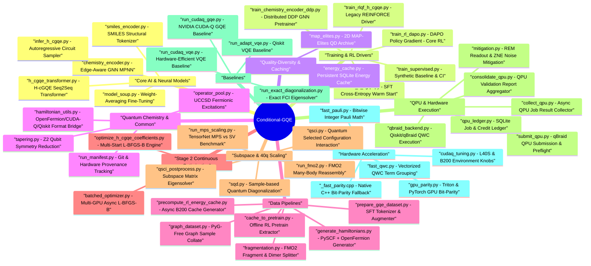

# Conditional-GQE (H-cGQE) Complete Codebase Mindmap & Architecture Guide

This document serves as the master mindmap, directory map, and architectural guide for the **Conditional-GQE (`Conditional-GQE_materials`)** codebase. It outlines the role, dependencies, inputs, outputs, and status of every package and script in the repository.

---

## 1. High-Level Mindmap (Mermaid)



---

## 2. Component Directory & File Reference

### 2.1 Core AI Models & Training Engine (`src/gqe/models/`)

| File | Purpose / Responsibility | Key Functions / Classes | Status |
| :--- | :--- | :--- | :--- |
| `h_cgqe_transformer.py` | Seq2Seq Transformer model conditioning on Hamiltonians to sample UCCSD operator sequences. | `HcGQEModel`, `HamiltonianEncoder`, `OperatorPoolDecoder`, `PauliStringEncoder` | **Active Core** |
| `train_rl_dapo.py` | Primary RL training loop using Decoupled Clip + Dynamic Sampling Policy Optimization (DAPO) with CUDA-Q energy rewards. | `ReplayBuffer`, `sample_sequences_with_logprobs`, `dapo_loss`, `evaluate_energies_qd` | **Active Core** |
| `train_h_cgqe.py` | Supervised Fine-Tuning (SFT) warm-start trainer using teacher-forced cross-entropy with commutator loss. | `train_epoch`, `_commutator_penalty`, `build_commute_table` | **Active Core** |
| `train_supervised.py` | Lightweight synthetic GRU trainer for quick environment checks and CI testing. | `TinySeqModel`, `_build_synthetic_dataset` | Active Baseline |
| `chemistry_encoder.py` | Edge-Aware Message-Passing GNN encoding molecular graph topology into latent conditioning vectors $\mathbf{z}$. | `ChemistryEncoder`, `EdgeAwareMessageBlock`, `ChemistryEncoderConfig` | **Active Core** |
| `train_chemistry_encoder.py` | Pre-training script for `ChemistryEncoder` via property regression. | `ChemistryRegressor`, `FlatChemistryRegressor` | Active Pretrain |
| `train_chemistry_encoder_ddp.py` | Multi-GPU DistributedDataParallel (DDP) scaling driver for `ChemistryEncoder`. | `_setup_distributed`, `DistributedSampler` | Active Pretrain |
| `infer_h_cgqe.py` | Autoregressive inference and sampling script with trailing non-entangling Z-only operator trimming. | `decode_operator_sequence`, `_is_trailing_noise` | **Active Core** |
| `export_conditioning_vectors.py` | Utility to pass molecular datasets through trained GNN and export prefix vectors. | `main` | Active Utility |
| `model_soup.py` | Implements Weight-Averaging (Model Soups) across RL/SFT checkpoints to improve OOD transfer. | `uniform_soup`, `greedy_soup` | Active Post-Proc |
| `train_rlqf_h_cgqe.py` | Legacy REINFORCE training script using fixed-$\theta$ energy rewards. | `_evaluate_fixed_theta_energy`, `_rollout_sequences` | Legacy |

---

### 2.2 Quality-Diversity & Persistent Cache (`src/gqe/rl/`)

| File | Purpose / Responsibility | Key Functions / Classes | Status |
| :--- | :--- | :--- | :--- |
| `energy_cache.py` | Thread-safe, SQLite-backed persistent database (`rl_energy_cache.sqlite`) storing circuit expectation values. | `PersistentEnergyCache`, `circuit_energy_cache_key`, `resolve_energies_with_cache` | **Active Core** |
| `map_elites.py` | 2D Quality-Diversity MAP-Elites archive (*Entanglement Density* $\times$ *Circuit Depth*) for intrinsic novelty bonuses. | `MAPElitesArchive`, `DedupCache`, `PerMoleculeArchives`, `compute_circuit_features` | **Active Core** |

---

### 2.3 Quantum Chemistry & System Infrastructure (`src/gqe/common/`)

| File | Purpose / Responsibility | Key Functions / Classes | Status |
| :--- | :--- | :--- | :--- |
| `operator_pool.py` | Constructs physics-preserving UCCSD fermionic excitation operator pools (0% Z-only operators). | `build_uccsd_operator_pool`, `build_uccsd_pauli_words`, `_jw_excitation_pauli_words` | **Active Core** |
| `hamiltonian_utils.py` | Converts between OpenFermion JSON, Qiskit `SparsePauliOp`, CUDA-Q `SpinOperator`, and dense FCI matrices. | `load_hamiltonian_records`, `hamiltonian_to_spin_operator`, `exact_diagonalize_hamiltonian` | **Active Core** |
| `run_manifest.py` | Captures git commit hash, environment, package versions, and SHA-256 hashes for experiment reproducibility. | `create_run_manifest`, `save_run_manifest`, `create_result_entry` | **Active Core** |
| `tapering.py` | Implements $Z_2$ qubit tapering via symmetry sectors to lower required qubit counts. | `taper_hamiltonian_record`, `_symmetry_eigenvalues` | Active Preproc |

---

### 2.4 Data Pipeline & Precomputation (`src/gqe/data/`)

| File | Purpose / Responsibility | Key Functions / Classes | Status |
| :--- | :--- | :--- | :--- |
| `generate_hamiltonians.py` | Primary data generator producing molecular Hamiltonians via PySCF + OpenFermion JW mapping. | `generate_from_config`, `_prepare_generator_kwargs` | **Active Core** |
| `prepare_gqe_dataset.py` | Tokenizes and augments raw baseline GQE sequences into supervised PyTorch `.pt` datasets. | `prepare_dataset`, `_augment_terms`, `_extract_operator_sequences` | **Active Core** |
| `graph_dataset.py` | PyG-free graph dataset and collation loader converting Hamiltonians to GNN `GraphSample` batches. | `GraphSample`, `HamiltonianGraphDataset`, `collate_graph_samples` | **Active Core** |
| `fragmentation.py` | FMO fragment and dimer decomposition logic, active space specifications (`ActiveSpaceSpec`). | `ActiveSpaceSpec`, `build_fragment_records`, `build_dimer_records` | **Active Core** |
| `fragment_molecule.py` | CLI tool wrapping `fragmentation.py` to inspect and export fragment plans. | `main` | Active CLI |
| `smiles_encoder.py` | Character-level SMILES tokenizer and transformer encoder for structural transfer learning. | `SmilesTokenizer`, `SmilesEncoder`, `MOLECULE_SMILES` | Active Core |
| `precompute_rl_energy_cache.py` | Multi-threaded async CUDA-Q precomputation script populating `rl_energy_cache.sqlite`. | `_sample_circuits_for_molecule`, `main` | Active Utility |
| `cache_to_pretrain.py` | Recovers explicit `(sequence, energy)` pairs from SQLite cache for offline RL buffer initialization. | `main` | Active Utility |

---

### 2.5 Evaluation, Subspace & Hardware Execution (`src/gqe/eval/`)

| File | Purpose / Responsibility | Key Functions / Classes | Status |
| :--- | :--- | :--- | :--- |
| `optimize_h_cgqe_coefficients.py` | Stage 2 driver: Multi-start L-BFGS-B parameter optimization for predicted operator sequences. | `optimize_coefficients`, `_build_kernel_for_sequence`, `_evaluate_energy` | **Active Core** |
| `sqd.py` | Sample-based Quantum Diagonalization (SQD) post-processing on computational basis QPU counts. | `solve_sqd`, `build_subspace_hamiltonian`, `filter_bitstrings_by_symmetry` | **Active Core** |
| `qpu_ledger.py` | SQLite job management ledger (`qpu_jobs.db`) enforcing budgets and tracking QPU states. | `QPULedger`, `estimate_cost`, `JobStatus`, `ErrorClass` | **Active Core** |
| `submit_qpu.py` | Builds Qiskit circuits from H-cGQE sequences, applies error mitigation, and submits to qBraid QPUs. | `_build_qiskit_circuit`, `main` | **Active Core** |
| `qsci.py` | QSCI scaling engine for 40q targets using CUDA-Q `tensornet-mps` state preparation + determinant sampling. | `qsci_energy_from_bitstrings`, `_make_hcgqe_kernel` | **Active Core (40q)** |
| `qsci_postprocess.py` | Classical subspace matrix constructor and eigensolver for QSCI sampled bitstrings. | `qsci_energy_from_bitstrings` | **Active Core** |
| `run_fmo2.py` | FMO2 many-body expansion driver ($E_{\text{FMO2}} = \sum E_I + \sum (E_{IJ}-E_I-E_J)$) using H-cGQE fragments. | `run_fmo2`, `hcgqe_fragment_energy`, `exact_energy_from_hamiltonian` | **Active Core** |
| `qbraid_backend.py` | Qiskit/qBraid execution pipeline using QWC term grouping and QASM2 serialization. | `_group_qwc_terms`, `_build_grouped_circuits`, `_circuit_to_qasm` | **Active Core** |
| `mitigation.py` | QPU error mitigation module providing Readout Error Mitigation (REM) and Zero-Noise Extrapolation (ZNE). | `calibrate_rem`, `apply_rem`, `fold_gates`, `zne_extrapolate` | **Active Core** |
| `collect_qpu.py` | Asynchronous retrieval tool for qBraid QPU jobs. | `collect_job` | Active Utility |
| `consolidate_qpu.py` | Aggregates raw QPU/simulator execution receipts into consolidated validation reports. | `main` | Active Utility |
| `run_mps_scaling.py` | Diagnostic script benchmarking MPS tensor network accuracy vs exact statevector simulation. | `_run_statevector`, `_run_mps`, `run_mps_scaling` | Diagnostic |
| `fmo2_error_decomposition.py` | Decomposes FMO2 error into solver error vs fragmentation error. | `main` | Active Analysis |
| `evaluate_h_cgqe.py` | Quick unoptimized evaluation script testing fixed-$\theta$ circuit expectations. | `_compute_circuit_energy`, `_ensure_cuda_context` | Diagnostic |

---

### 2.6 Baselines (`src/gqe/baselines/`)

| File | Purpose / Responsibility | Key Functions / Classes | Status |
| :--- | :--- | :--- | :--- |
| `run_cudaq_gqe.py` | NVIDIA `cudaq-solvers[gqe]` baseline solver running greedy iterative UCCSD selection. | `_ensure_cuda_context`, `main` | **Active Baseline** |
| `run_cudaq_vqe.py` | Hardware-Efficient VQE ($Ry-CX$ layers) baseline using CUDA-Q `solvers.vqe`. | `_build_hwe_ansatz`, `main` | **Active Baseline** |
| `run_exact_diagonalization.py` | Full Configuration Interaction (FCI) reference ground-state eigensolver for $\le 14$ qubits. | `exact_diagonalize_hamiltonian`, `main` | **Active Reference** |
| `run_adapt_vqe.py` | Qiskit `EfficientSU2` + `SLSQP` VQE baseline. | `run_vqe_on_record`, `main` | Reference |
| `run_cudaq_gqe_mqpu.py` | Multi-GPU accelerated CUDA-Q GQE baseline (`nvidia-mqpu`). | `main` | Active Baseline |
| `run_cudaq_gqe_conditioned.py` | CUDA-Q GQE baseline weighted by chemistry GNN embeddings. | `main` | Diagnostic |
| `run_cudaq_gqe_chunk.py` | Distributed Slurm task chunk runner for GQE baselines. | `main` | Active Baseline |

---

### 2.7 Hardware Acceleration Layer (`src/gqe/accel/`)

| File | Purpose / Responsibility | Key Functions / Classes | Status |
| :--- | :--- | :--- | :--- |
| `cudaq_tuning.py` | Configures CUDA-Q environment variables (`CUDAQ_ENABLE_MEMPOOL`, gate fusion, L40S & B200 presets). | `apply_cudaq_env`, `apply_for_l40s`, `apply_for_b200` | **Active Acceleration** |
| `fast_pauli.py` | Vectorized Pauli operator math using 2-bit integer encodings ($(0,0)=I, (1,0)=X, (1,1)=Y, (0,1)=Z$). | `pauli_to_masks`, `are_qwc`, `qwc_compatibility_matrix` | **Active Acceleration** |
| `fast_qwc.py` | Vectorized $O(1)$ Qubit-Wise Commutativity (QWC) term grouping on CPU/GPU. | `group_qwc_terms_vectorized`, `_qwc_compat_matrix_gpu` | **Active Acceleration** |
| `gpu_parity.py` | GPU-accelerated bitwise popcount parity calculation for parsing QWC measurement counts. | `parse_grouped_results_gpu`, `_parse_counts_triton` | **Active Acceleration** |
| `batched_optimizer.py` | Asynchronous multi-GPU batched L-BFGS-B parameter optimizer via `cudaq.observe_async()`. | `optimize_coefficients_batched` | **Active Acceleration** |
| `_fast_parity.cpp` & `setup.py` | C++ pybind11 native extension for $O(1)$ C++ bitwise parity calculation. | `parse_bitstring_parity` | Active C++ Fallback |

---

## 3. Data & Checkpoint Artifact Map (`results/`)

```
results/
├── data/
│   ├── hamiltonians.json                  # 35 GIC challenge molecules (4–28q)
│   ├── hamiltonians_merged.json           # 21 SFT/scaling molecules (4–40q)
│   └── hamiltonians_40plus.json/          # 10 XL scaling molecules (Benzene 40q, N2 40q)
├── train/
│   ├── h_cgqe_model_b200_sft.pt           # SFT warm-start checkpoint (31 MB)
│   ├── h_cgqe_model_b200_rl_main.pt       # DAPO RL model (35 GIC molecules, 40 MB)
│   ├── h_cgqe_model_b200_rl_40q.pt        # Extended DAPO RL model (40q, 40 MB)
│   ├── h_cgqe_model_b200_rl_scratch.pt    # Ablation: direct RL from scratch (40 MB)
│   ├── rl_energy_cache.sqlite             # SQLite persistent circuit -> energy database
│   └── *_metrics.json                     # Training logs and reward history
├── eval/
│   ├── h_cgqe_optimized.json              # Stage 2 L-BFGS-B optimized parameters
│   ├── h_cgqe_rl_optimized.json           # RL circuit optimized parameters
│   └── simulator_benchmark.json           # GPU simulator validation benchmark
├── qpu/
│   ├── qpu_jobs.db                        # SQLite QPU execution & credit ledger
│   ├── cepheus_rl_sqd_results.json        # Rigetti Cepheus 108q SQD execution results
│   └── *_manifest.json                    # QASM and QWC measurement manifests
└── phase3_final/
    ├── consolidated_phase3_results.json   # Full benchmark suite results
    └── benchmark_ch3i_consolidated.json   # Methyl iodide QPU benchmark
```

### B200/Blackwell Scripts (`scripts/`)

| Script | Purpose |
|---|---|
| `launch_b200_training.sh` | Unified B200 launcher: SFT → RL → RL-40q, cache, ablation |
| `run_b200_training.sh` | Portable single-B200 training launcher (env-var configurable) |
| `env_b200_blackwell.sh` | Blackwell env vars: cuBLAS BF16x9, CUDA-Q FP32 emulation, PyTorch TF32 |
| `run_40q_scaling_pipeline.sh` | End-to-end 4q→40q scaling pipeline on B200 (SV + MPS + QPU) |
| `precompute_rl_energy_cache.py` | Async B200 cache generator for SQLite energy cache |
